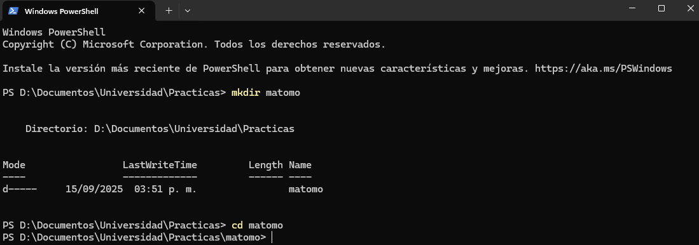
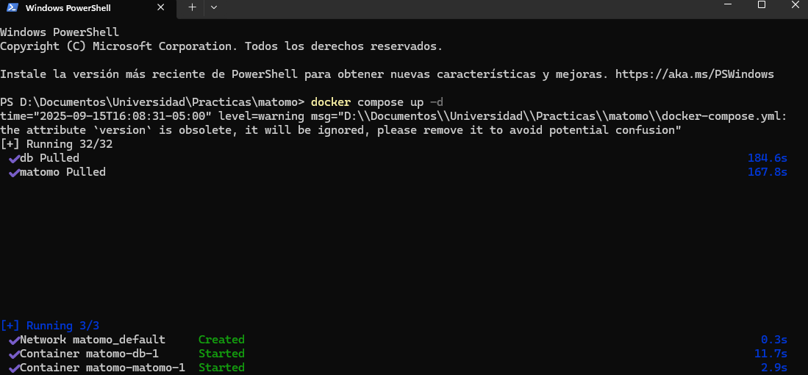
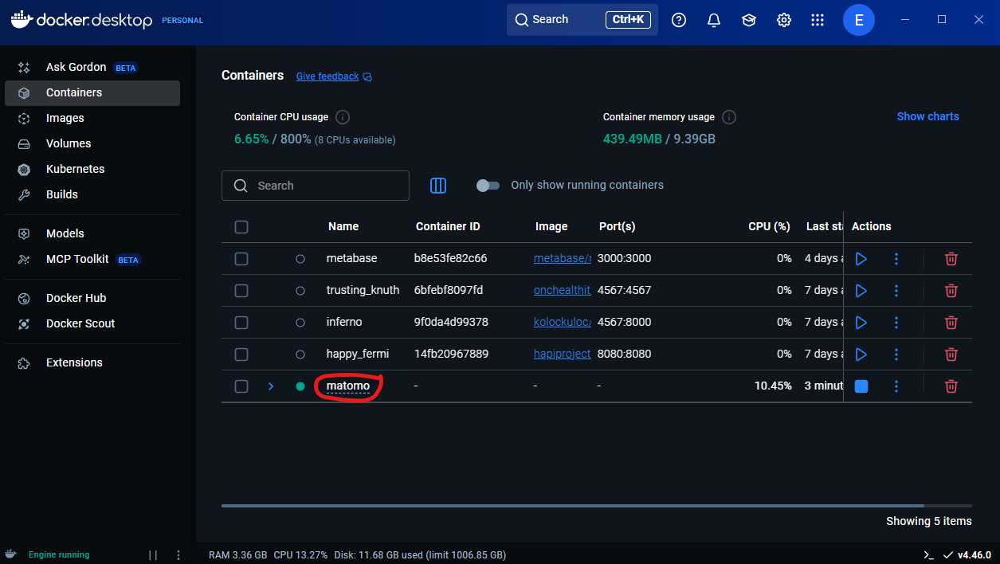

# Instlación de las herramientas necesarias para el desarrollo del MVP 📄🛠️ 

Esta es una guía destinada para explicar la instalación de tres herramientas, para el desarrollo del MVP, las cuales son Matomo, Metabase y n8n

---

## Instalación de Matomo

Matomo puede ser instalado, de dos formas, en un ambiente cloud o en un ambiente On-Premise, en este caso lo haremos en un entorno On-Premise, para ello usaremos docker, como herramienta para crear un contenedor de Matomo

- Paso 1

--Creamos la carpeta del proyecto, desde la consola, podemos usar la interfaz gráfica o ejecutar el comando **mkdir nombre_carpeta** y hacemos un **cd** hacia la misma, es decir, entramos al directorio recientemente creado

```bash
mkdir nombre_carpeta
cd nombre_carpeta
```



- Paso 2 

-- Dentro del directorio, creamos el archivo **docker-compose.yml** con esta configuración: 

```bash
services:
  matomo:
    image: matomo:latest
    restart: always #para que se reinicie en caso de que se caiga
    ports:
      - "8080:80" #mapear el puerto 80 del contenedor al puerto 8080 del host
    environment: #variables de entorno para la configuracion de la base de datos
      - MATOMO_DATABASE_HOST=db
      - MATOMO_DATABASE_ADAPTER=mysql
      - MATOMO_DATABASE_TABLES_PREFIX=matomo_
      - MATOMO_DATABASE_USERNAME=matomo
      - MATOMO_DATABASE_PASSWORD=matomopass
      - MATOMO_DATABASE_DBNAME=matomodb
    volumes:
      - matomo_data:/var/www/html
    depends_on:
      - db

  db:
    image: mysql:9.4.0
    restart: always #para que se reinicie en caso de que se caiga
    environment: #variables de entorno para la configuracion de la base de datos
      - MYSQL_ROOT_PASSWORD=rootpass
      - MYSQL_DATABASE=matomodb
      - MYSQL_USER=matomo
      - MYSQL_PASSWORD=matomopass
    volumes:
      - db_data:/var/lib/mysql

volumes:
  matomo_data:
  db_data:
```

- Paso 3

-- Luego de crear el docker-compose.yml con la configuración proporcionada, procedemos a ejecutar u orquestar nuestros contenedores, con el siguiente comando **docker compose up -d**, este se ejecuta desde la terminal dentro del directorio. Como se muestra a continuación:

```bash
    docker compose up -d
```



- Paso 4

-- Si se cuenta con docker desktop, podemos ver dentro de la sección contenedores que está en ejecución nuestra orquestación



-- O puedes ejecutar el siguiente comando desde la terminal: 

```bash
docker ps
```

-- Y listo, ahora podemos acceder a matomo desde nuestro navegador de preferencia mediante esta url: 

```bash
http://localhost:8080
```

## Instalación de Metabase

Al igual que Matomo, Metabase puede ser instalado de dos formas, en la nube o cloud o de manera local

En este caso seguiremos la instalación rápida que se establace en la documentación de metabase: 

```bash
https://www.metabase.com/docs/latest/installation-and-operation/running-metabase-on-docker
```

- Paso 1 

-- Debido a que estamos siguiendo la instalació rápida, hacemos un pull de la imagen de metabase en **docker hub**, por lo que dentro de la consola ejecutamos el siguiente comando: 

```bash
docker pull metabase/metabase:latest
```

- Paso 2 

-- Después de hacer pull a la imagen, procedemos a ejecutar el contenedor: 

```bash
docker run -d -p 3000:3000 --name metabase metabase/metabase
```

- Paso 3 

-- Luego de ejecturar el contenedor, accedemos a Metabase, mediante la siguiente URL: 

```bash
http://localhost:3000
```

## Instalación de n8n

-- Al igual que las herramientas anteriores, n8n cuenta con dos ambientes en el que puede se usado, de forma local y en la nube o cloud. Para este caso, procederemos a hacer la instlación de forma autoalojada, es decir, de forma local, usando docker. Para ello, seguiremos la documentación ofrecida por n8n. 

```bash
https://docs.n8n.io/hosting/installation/docker/
```

- Paso 1

-- La documentación de la herramienta lo hace bastante sencillo, solo hay que ejecutar dos comandos, que son estos: 

```bash
docker volume create n8n_data
```

```bash
docker run -it --rm \
 --name n8n \
 -p 5678:5678 \
 -d \
 -e GENERIC_TIMEZONE="<YOUR_TIMEZONE>" \
 -e TZ="<YOUR_TIMEZONE>" \
 -e N8N_ENFORCE_SETTINGS_FILE_PERMISSIONS=true \
 -e N8N_RUNNERS_ENABLED=true \
 -v n8n_data:/home/node/.n8n \
 docker.n8n.io/n8nio/n8n
```


